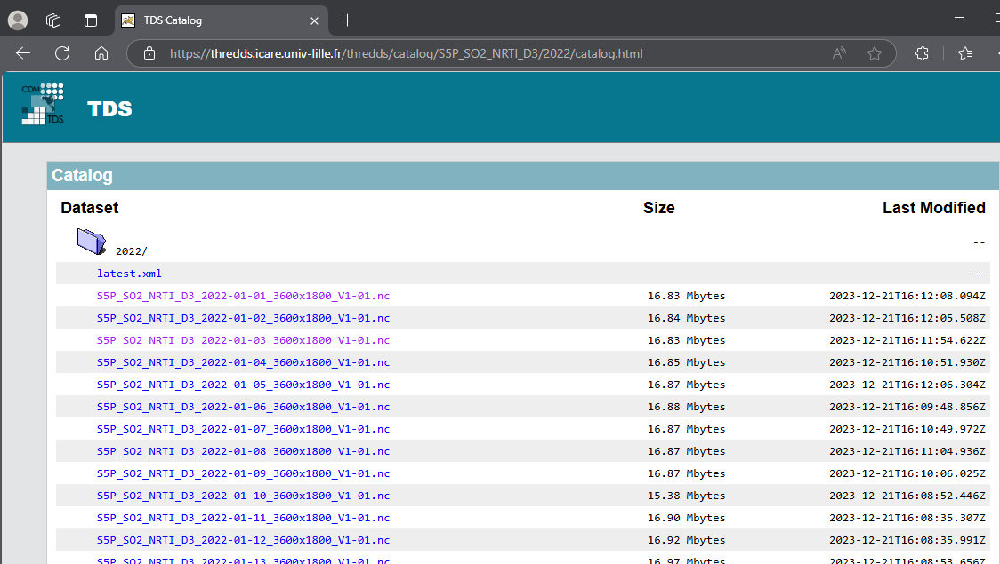
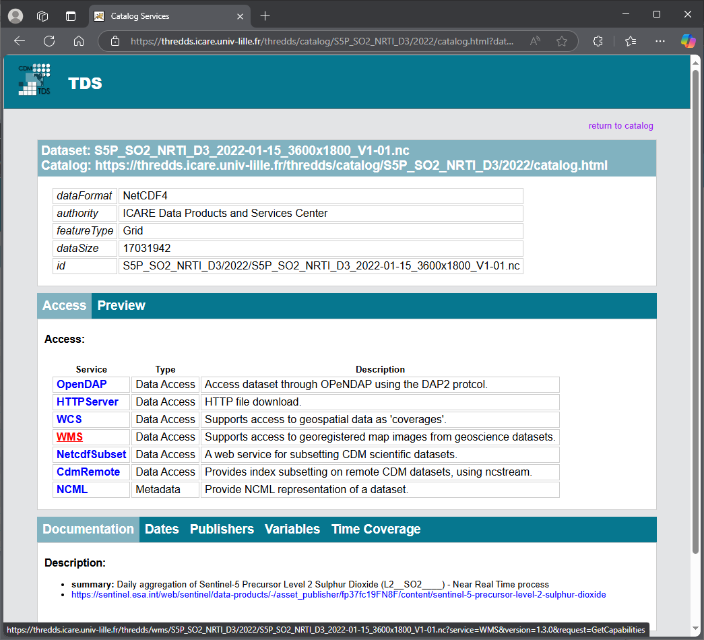
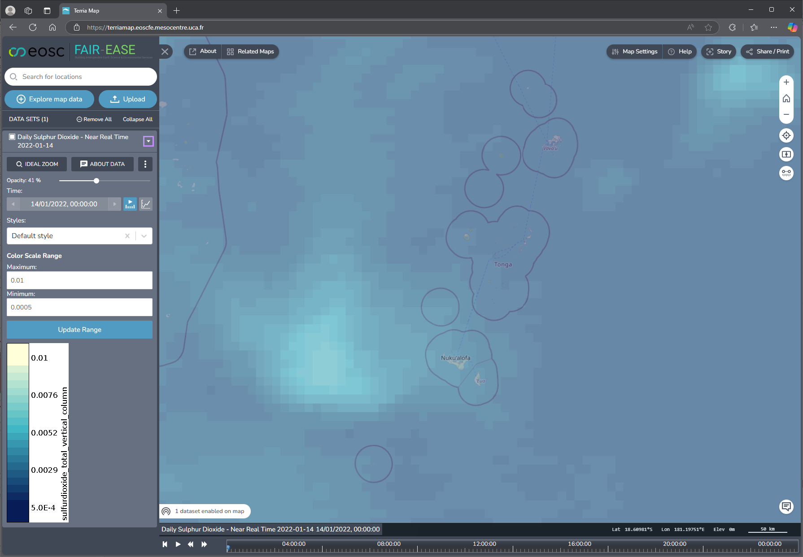
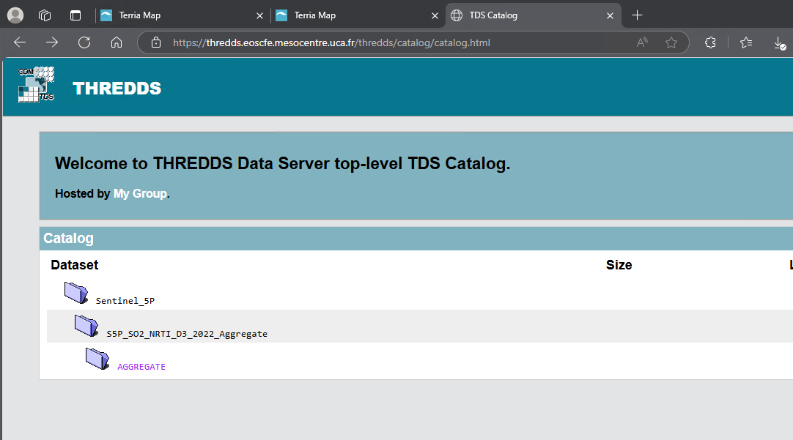
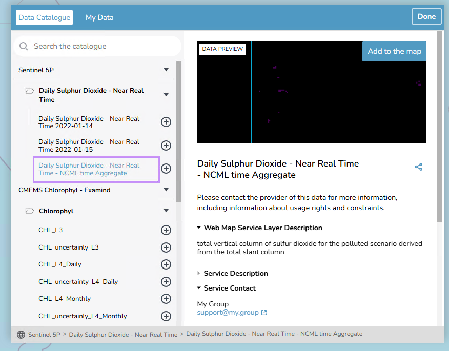
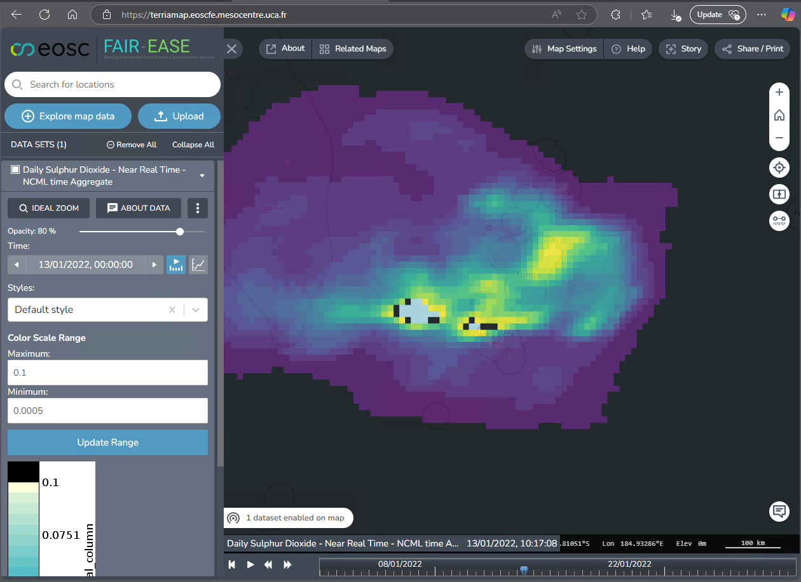

## Thredds Data set Examples

The University of Lille Sentinel 5 Sulphur dioxide (SO2) data is
accessible on their Thredds server at

<https://thredds.icare.univ-lille.fr/thredds/catalog/catalogs/S5PCatalog.html>

For example the Sentinel 5 SO2 NRTI data for individual days in 2022 is
available at

<https://thredds.icare.univ-lille.fr/thredds/catalog/S5P_SO2_NRTI_D3/2022/catalog.html>

Sulphur Dioxide is of interest as it is a typical volcanic gas emission.



Clicking on an individual file hyperlink will provide the WMS
getCapabilities URL information as well as other data interfaces.



The WMS getCapabilities URL for the file can then be used in the
Terriamap using the

### Thredds Snippet

```json
{
  "type": "group",
  "isOpen": **true**,
  "name": "Sentinel 5P",
  "members": [
   {
    "type": "group",
    "name": "Daily Sulphur Dioxide - Near Real Time",
    "isOpen": **true**,
"members": [
  {
    "type": "wms",
"name": "Daily Sulphur Dioxide - Near Real Time 2022-01-14",
"url": "https://thredds.icare.univ-lille.fr/thredds/wms/S5P_SO2_NRTI_D3/2022/S5P_SO2_NRTI_D3_2022-01-14_3600x1800_V1-01.nc?service=WMS&version=1.3.0&request=GetCapabilities",
"layers": "sulfurdioxide_total_vertical_column",
"colorScaleMinimum": 0.0005,
"colorScaleMaximum": 0.01
},
{
"type": "wms",
"name": "Daily Sulphur Dioxide - Near Real Time 2022-01-15",
"url":"https://thredds.icare.univ-lille.fr/thredds/wms/S5P_SO2_NRTI_D3/2022/S5P_SO2_NRTI_D3_2022-01-15_3600x1800_V1-01.nc?service=WMS&version=1.3.0&request=GetCapabilities",
"layers": "sulfurdioxide_total_vertical_column",
"colorScaleMinimum": 0.0005,
"colorScaleMaximum": 0.01
},
{
"type": "wms",
"name": "Daily Sulphur Dioxide - Near Real Time - NCML time Aggregate",
"url":"https://thredds.eoscfe.mesocentre.uca.fr/thredds/wms/S5P_SO2_NRTI_D3_2022/AGGREGATE?service=WMS&version=1.3.0&request=GetCapabilities",
"layers": "sulfurdioxide_total_vertical_column",
"colorScaleMinimum": 0.0005,
"colorScaleMaximum": 0.1
}
]
}
]
}
```
Allowing the SO2 dataset to be brought in as a “wms” type, layer to the
Terriamap viewer



## Thredds and NCML file aggregation

The university of Lille’s thredds datasets are typically all individual
files, visualising or adding each of these files individually to
Terriamap would create a cluttered interface, however it is possible to
aggregate multiple individual netcdf into one “virtual” netcdf file
using NCML in a thredds dataset definition, this provides a way to point
thredds at a directory of files and tell it which filename pattern to
use and which dimension in the files can be used to join the individual
files together virtually.

The University of Lille thredds server also provides the data as time
aggregated virtual datasets

<https://thredds.icare.univ-lille.fr/thredds/catalog/catalogs/S5PCatalog.html>

The University of Lille SO2 satellite datasets are joined together on
the “time” dimension to create a single aggregate virtual files that
will also appear as a WMS timeseries datasets in the thredds WMS
interface for the aggregated virtual file.

To create a working example of how this is achieved a number of Sentinel
SO2-NRTI netcdf files were downloaded from the university of Lille’s
thredds server to the directory

/opt/data/so2-nrti/

So in the directory there are a number of netcdf files for each day
e.g.:
```console
S5P_SO2_NRTI_D3_2022-01-03_3600x1800_V1-01.nc
S5P_SO2_NRTI_D3_2022-01-04_3600x1800_V1-01.nc
S5P_SO2_NRTI_D3_2022-01-05_3600x1800_V1-01.nc
...
S5P_SO2_NRTI_D3_2022-01-28_3600x1800_V1-01.nc
S5P_SO2_NRTI_D3_2022-01-29_3600x1800_V1-01.nc
S5P_SO2_NRTI_D3_2022-01-30_3600x1800_V1-01.nc
```
On the thredds server on the UCA infrastructure, the following file
“s5p_so2_nrti_aggregation.xml” was used to create a new virtual dataset
“S5P_SO2_NRTI_D3_2022/AGGREGATE” on the UCA Thredds server

```xml
<catalog xmlns="http://www.unidata.ucar.edu/namespaces/thredds/InvCatalog/v1.0" xmlns:xlink="http://www.w3.org/1999/xlink" name="Aggregation"\>
 <dataset name="S5P_SO2_NRTI_D3_2022" ID="S5P_SO2_NRTI_D3_2022_Aggregate" urlPath="S5P_SO2_NRTI_D3_2022/AGGREGATE"\>
   <serviceName\>grid</serviceName\>
     <netcdf xmlns="http://www.unidata.ucar.edu/namespaces/netcdf/ncml-2.2"\>
        <aggregation dimName="time" type="joinExisting"\>
        <scan location="/opt/data/so2-nrti/" suffix=".nc" /\>
        </aggregation>
      </netcdf>
  </dataset>
</catalog>
``` 
This file is then referenced in the root thredds “catalog.xml” file like
so

<dataset name="Sentinel_5P"\>
 <dataset name="S5P_SO2_NRTI_D3_2022_Aggregate"\>
 <catalogRef xlink:href='s5p_so2_nrti_aggregation.xml'
 xlink:title='AGGREGATE' name=''/\>
</dataset>
</dataset>



The Thredds WMS interface to the virtual aggregated file can be
referenced in Terriamap as follows:

```json
{
"type": "wms",
"name": "Daily Sulphur Dioxide - Near Real Time - NCML time Aggregate",
"url":"https://thredds.eoscfe.mesocentre.uca.fr/thredds/wms/S5P_SO2_NRTI_D3_2022/AGGREGATE?service=WMS&version=1.3.0&request=GetCapabilities",
"layers": "sulfurdioxide_total_vertical_column",
"colorScaleMinimum": 0.0005,
"colorScaleMaximum": 0.1
}
```
This will appear in the Terriamap “Data Catalogue” as a single entry



After adding the Aggregate dataset to the map, the time series selection
is available in the Terriamap interface



