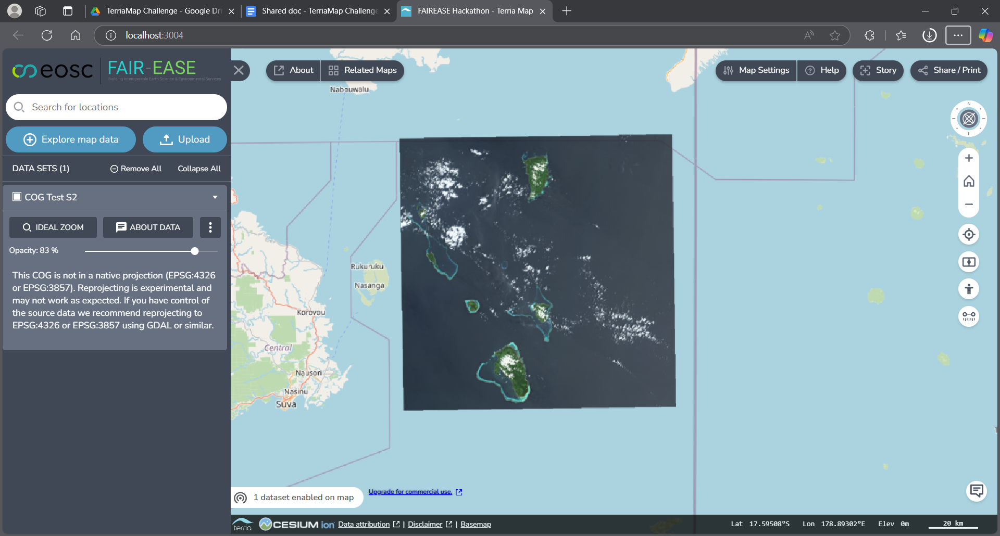

## Cloud Optimised Geotiffs (COG)

Cloud Optimised Geotiffs(COG) are an enhancement to the geotiff data
format that allows for efficient partial downloading and streaming of
georeferenced image or grid data to a client that supports the format.
Typically Cloud Optimised Geotiffs are used to display satellite
imagery.

An example Sentinel 2 true colour (TCI) Satellite imagery from the Hunga
Tonga area was downloaded and added to terriamap, the map projection
format of the data seemed to necessitate the use of the “3D” Map mod in
Terriamap to visualise the COG, (supports the geotiff map projection)



### COG Sentinel 2 snippet
```json
{

"name": "COG Test S2",
"description": "This is a COG from Sentinel 2",
"type": "cog",
"url": "test/TCI.tif",
"id": "sent2truecolcog"

}
```

