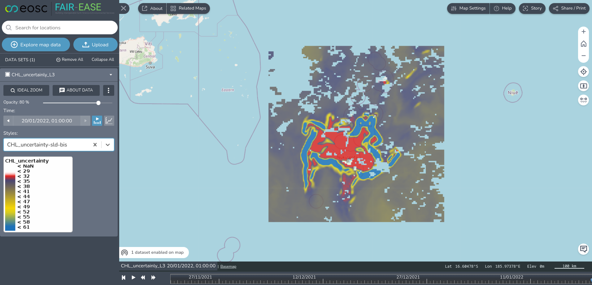
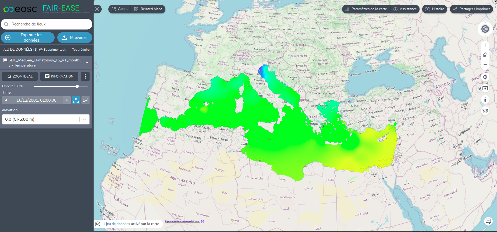

### WMS

Terriamap supports configuring “Catalogue groups” for adding multiple
layers of data from a service e.g. from a “wms-group” type, where all
the layers available from a getCapability URL can be available as layers
in Terriamap. This was used in the hackathon to visualise data from the
Ifremer sextant.ifremer.fr server.

#### Using a Sextant WMS service in a wms-group
```json
{
"name": "WMS SEXTANT",
"id": "wms_sextant",
"url": "https://sextant.ifremer.fr/services/wms/oceanographie_physique",
"isOpen": false,
"type": "wms-group"
}
```
WMS used: “Percentile 90 de la Chlorophylle (MODIS)” -\> ”Chlorophyll
90th Percentile (MODIS)”


### WMS From Examind

#### Using Examind WMS from a “wms-group” Catalogue Group example

All layers available from a particular Examind WMS URL
```json
{
"name": "CMEMS WMS (All) - Examind",
"id": "cmemswmsexamind",
"url":
"https://examind.eoscfe.mesocentre.uca.fr/examind/WS/wms/CMEMS_WMS",
"isOpen": false,
"type": "wms-group"
}
```
Using single layers from Examind using the “wms” “Catalogue Item”

WMS layers(groups, with selected wms layers)
([<u>https://docs.terria.io/guide/connecting-to-data/catalog-type-details/wms/</u>](https://docs.terria.io/guide/connecting-to-data/catalog-type-details/wms/))

```json
{
"type": "group",
"isOpen": true,
"name": "CMEMS Chlorophyl - Examind",
"members": [
{
"type": "group",
"name": "Chlorophyl",
"isOpen": true,
"members": [
{
"type": "wms",
"name": "CHL_L3",
"url":
"https://examind.eoscfe.mesocentre.uca.fr/examind/WS/wms/CMEMS_WMS?service=WMS&version=1.3.0&request=GetCapabilities",
"layers": "CHL_L3"
},
{
"type": "wms",
"name": "CHL_uncertainly_L3",
"url":
"https://examind.eoscfe.mesocentre.uca.fr/examind/WS/wms/CMEMS_WMS?service=WMS&version=1.3.0&request=GetCapabilities",
"layers": "CHL_uncertainly_L3",
"availableStyles": [
{
"layerName": "CHL_uncertainly_L3",
"styles": [
{
"name": "CHL_uncertainty-sld",
"title": "CHL_uncertainty-sld",
"abstract": ""
},
{
"name": "CHL_uncertainty-sld-bis",
"title": "CHL_uncertainty-sld-bis",
"abstract": ""
}
]}]}]}]}
```




### WMS from ERDDAP

Using Ifremer ERDDAP
([<u>https://erddap.ifremer.fr</u>](https://erddap.ifremer.fr)) the
datasets listed on the ERDDAP WMS page
[<u>https://erddap.ifremer.fr/erddap/wms/index.html</u>](https://erddap.ifremer.fr/erddap/wms/index.html)
can be configured in Terriamap
```json
{
"name": "WMS ERDDAP",
"id": "wms_erddap",
"url":
"https://erddap.ifremer.fr/erddap/wms/SDC_MED_CLIM_TS_V1_m/request",
"isOpen": false,
"type": "wms-group"
}
```
WMS used : “SDC_MedSea_Climatology_TS_V1_monthly - Temperature” @ 0
meters



### WMS From THREDDS

Using Ifremer THREDDS
([<u>https://tds1.ifremer.fr</u>](https://erddap.ifremer.fr))

```json
{
"name": "WMS thredds",
"id": "wms_thredds",
"url":
"https://tds1.ifremer.fr/thredds/wms/MARC-MANGAE2500-MARS3D_F1-FOR_FULL_TIME_SERIE",
"isOpen": false,
"type": "wms-group"
}
```

WMS used : sea_water_potential_temperature

