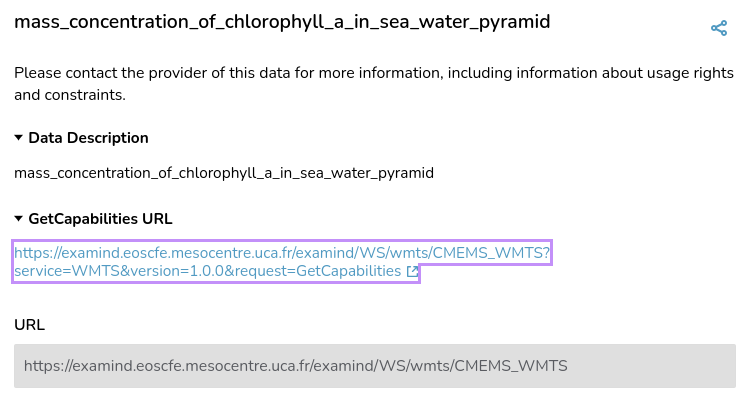

### WMTS

Using Sextant WMTS service.
```json
{
"name": "WMTS SEXTANT",
"id": "wmts_sextant",
"url": "https://sextant.ifremer.fr/geowebcache/service/wmts",
"isOpen": false,
"type": "wmts-group"
}
```
WMTS used: “Brest 1929” (Old Aerial Imagery of Brest, taken in 1929)


An Examind WMTS layer was also tested

<https://examind.eoscfe.mesocentre.uca.fr/examind/WS/wmts/CMEMS_WMTS>

Unfortunately while the GetCapabilities was read correctly by TerriaMap,
no data was displayed, we didn't have time to investigate further.


```json

{
"name": "WMTS Examind",
"id": "wmts_examind",
"url":
"https://examind.eoscfe.mesocentre.uca.fr/examind/WS/wmts/CMEMS_WMTS",
"isOpen": false,
"type": "wmts-group"
}
```