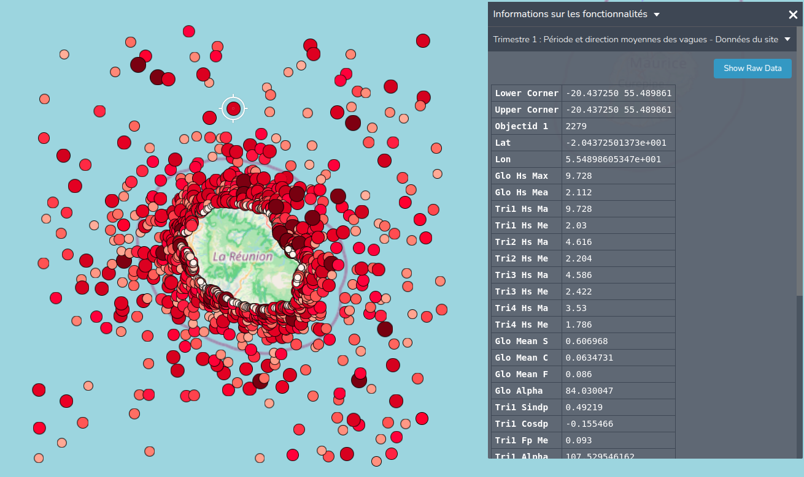

### WFS

Using Sextant “ocean_indien” WFS service.
```json
{
"name": "WFS SEXTANT",
"id": "wfs_sextant",
"url": "https://sextant.ifremer.fr/services/wfs/ocean_indien",
"isOpen": false,
"type": "wfs-group"
}
```

WFS used : “Trimestre 1 : Période et direction moyennes des vagues”. -\>
“1st Trimester :

Average wave period and direction”


