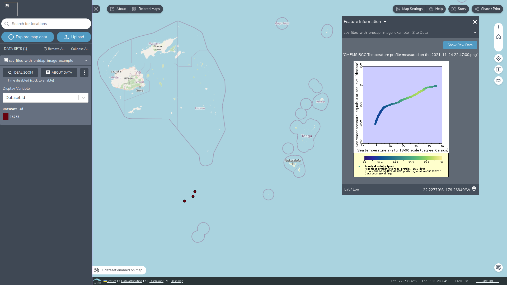

## ERDDAP Data services:

While Terriamap can use ERDDAP WMS services and various file formats
exported from ERDDAP, dynamically requesting and using CSV or Geojson
data directly from the Restful ERDDAP services seems to have mixed
results. Currently there is no Native “ERDDAP server” Datatype or
support for ERDDAP Restful GRIDDAP or TABLEDAP services.

### ERDDAP Restful Services 

Terriamap’s handling of Restful URLs e.g. to dynamically request CSV
data using the Terriamap’s [CSV Catalog
Item](https://docs.terria.io/guide/connecting-to-data/catalog-type-details/csv/)
for specific time periods was found to have problems parsing some urls
and character encodings in the URLs. Possible approaches using url
shortening services e.g. TinyURL were initially suggested as a
workaround and Marc Portier(VLIZ) suggested W3id (<https://w3id.org/> )
persistent identifiers as a more open alternative to URL shortening
services.

The Hackathon briefly investigated possible approaches to improving
ERDDAP server access from Terriamap.

The Terriamap or ERDDAP communities could develop more specific support
for ERDDAP and introduce an ERDDAP “Catalog group” or ERDDAP “Catalog
Item”. This could upon

An ERDDAP “Catalog Item” would need to be defined in Terriajs (which is
embedded in TerriaMap (Terriajs is a “Core” Library that terriamap
uses)).

An Erddap Model(s) would need to be created:
[<u>https://github.com/TerriaJS/terriajs/tree/main/lib/Models/Catalog</u>](https://github.com/TerriaJS/terriajs/tree/main/lib/Models/Catalog)

And also possibly ERDDAP Files readers (
[<u>https://github.com/TerriaJS/terriajs/tree/main/lib/Core</u>](https://github.com/TerriaJS/terriajs/tree/main/lib/Core)
)

And a definition of the ERDDAP data/catalog type :
[<u>https://github.com/TerriaJS/terriajs/tree/main/lib/ModelMixins</u>](https://github.com/TerriaJS/terriajs/tree/main/lib/ModelMixins)

The Hackathon also investigated URL encoding techniques and had some
success with some ERDDAP datasets.

For a GRIDDAP (a multidimensional Array) datasets, a URL can be modified
to work around problematic characters, by URL encoding or percent
encoding these problematic characters

e.g.

[<u>https://erddap.ifremer.fr/erddap/griddap/SDC_BAL_CLIM_TS_V1_m.csv?ITS_90_water_temperature\[(2009-12-16T00:00:00Z):1:(2009-12-16T00:00:00Z)\]\[(0.0):1:(300.0)\]\[(53.0):1:(66.0)\]\[(9.0):1:(31.0)</u>](https://erddap.ifremer.fr/erddap/griddap/SDC_BAL_CLIM_TS_V1_m.csv?ITS_90_water_temperature%5B(2009-12-16T00:00:00Z):1:(2009-12-16T00:00:00Z)%5D%5B(0.0):1:(300.0)%5D%5B(53.0):1:(66.0)%5D%5B(9.0):1:(31.0))\]

can be URL or percent encoded as follows:
[<u>https://erddap.ifremer.fr/erddap/griddap/SDC_BAL_CLIM_TS_V1_m.csv?ITS_90_water_temperature%5B(2009-12-16T00:00:00Z):1:(2009-12-16T00:00:00Z)%5D%5B(0.0):1:(300.0)%5D%5B(53.0):1:(66.0)%5D%5B(9.0):1:(31.0)%5D</u>](https://erddap.ifremer.fr/erddap/griddap/SDC_BAL_CLIM_TS_V1_m.csv?ITS_90_water_temperature%5B(2009-12-16T00:00:00Z):1:(2009-12-16T00:00:00Z)%5D%5B(0.0):1:(300.0)%5D%5B(53.0):1:(66.0)%5D%5B(9.0):1:(31.0)%5D)


With TableDAP, there were some successes with datasets by percent
encoding the ‘=’ signs from the ERDDAP encoded url:
[<u>https://erddap.ifremer.fr/erddap/tabledap/SDC_NATL_AGG_V2.csv?time,station_id,platform,obs_date_qc,latitude,longitude,position_qc,depth,depth_qc,temp,temp_qc,psal,psal_qc,type&time</u>](https://erddap.ifremer.fr/erddap/tabledap/SDC_NATL_AGG_V2.csv?time,station_id,platform,obs_date_qc,latitude,longitude,position_qc,depth,depth_qc,temp,temp_qc,psal,psal_qc,type&time)\>=2019-05-28T00:00:00Z&time\<=2019-06-04T08:10:41Z

Which becomes the following when the equal sign is percent encoded:

<https://erddap.ifremer.fr/erddap/tabledap/SDC_NATL_AGG_V2.csv?time%2Cstation_id%2Cplatform%2Cobs_date_qc%2Clatitude%2Clongitude%2Cposition_qc%2Cdepth%2Cdepth_qc%2Ctemp%2Ctemp_qc%2Cpsal%2Cpsal_qc%2Ctype&time%3E%3D2019-05-28T00%3A00%3A00Z&time%3C%3D2019-06-04T08%3A10%3A41Z>

### ERDDAP Plots

ERDDAP plots can be called from within the Terriamap feature info
template and these calls can make use of the mustache templates to pass
some identifiers and values to call ERDDAP to dynamically render charts
and graphics for use in the pop up feature info box, we describe below
how this can be used for plotting Argo float data.

### Using ERDDAP plots for Argo profile data

At present to display the Argo profile data in Terriamap using ERDDAP
plots you need two different datasets.

- one CSV file that regroup metadata information such as: latitude,
  longitude, platform code and time, this is necessary to display the
  points on Terria Map.

- an ERDDAP server with a corresponding Argo dataset to draw on-the-fly
  the profiles to display in the feature info template associated with a
  particular Argo float for the time period of interest.

The columns in the first CSV file can be used as variable in the code
(e.g. datetime or platform_code).

Snippet:
```json
{
"type": "csv",
"name": "csv_files_with_erddap_image_example",
"url": "test/CMEMS_BGC_station_overview.csv",
"featureInfoTemplate": {
"template": "<div class='abc'>'CMEMS BGC Temperature profile measured on the {{datetime}}.png'<figure></figure></div>",
"showFeatureInfoDownloadWithTemplate": false
},
"defaultStyle":{"time":{"timeColumn":null}},
"activeStyle": "dataset_id",
"showDisableTimeOption": true
}
```
Result:


